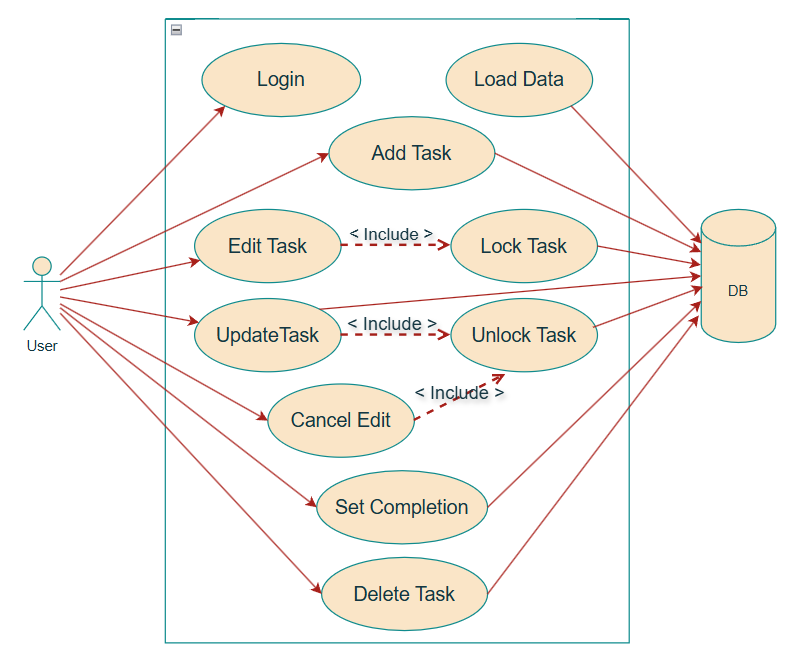
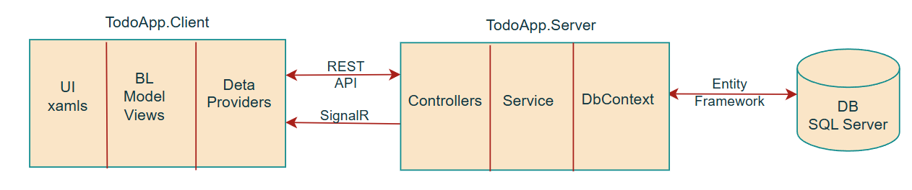

# TodoApp – Real-Time Synchronized To-Do List

> **Tech stack:** WPF (.NET 8) • ASP.NET Core 8 Web API • SignalR • SQL Server • EF Core 8

---

## 1 · Architecture Overview

### Use-Case Diagram


### Logical Components


| Tier        | Technology                | Responsibility                                  |
|-------------|---------------------------|-------------------------------------------------|
| **Client**  | WPF + MVVM                | UI, state, commands                             |
| **Server**  | ASP.NET Core API + SignalR| CRUD + real-time broadcast + business rules     |
| **Data**    | SQL Server + EF Core 8    | Persistence, migrations, transactions           |

---

## 2 · Communication Protocol reasoning

| Channel | reasoning |
|---------|---------------------|
| **HTTPS REST API** | Ideal for CRUD – stateless, cacheable, discoverable via Swagger / Postman. Can be secured later with cookies or bearer tokens. |
| **SignalR (WebSocket)** | Real-time events: `TaskAdded`, `TaskUpdated`, `TaskDeleted`, `TaskLocked`, `TaskUnlocked`. <br> Keeps every client in sync without polling, minimises traffic, auto-reconnects.<br>Has built-in scalability, simplicity of use, and easy integration with .NET ecosystems. |

---

## 3 · Design Patterns

| Pattern | In Code | Benefit |
|---------|---------|---------|
| **MVVM** | `TasksViewModel`, etc. | Testable UI, clear separation, data binding. |
| **Repository + Unit of Work** | `TaskItemsService` ⇢ `TodoDbContext` | Single gateway to DB; one atomic transaction per request. |
| **Pub/Sub** | SignalR hub | Decoupled event distribution to all clients. |
| **Singleton** | `ErrorHandler` | One global policy for logging & user feedback. |
| **Dependency Injection** | Built-in DI, WPF ServiceCollection | Loose coupling, easy mocking. |
| **Observer** | `INotifyPropertyChanged`, `ObservableCollection` | Automatic UI refresh when data changes. |

---

## 4 · Prerequisites

* .NET 8 SDK  
* SQL Server / Express / LocalDB  
* Visual Studio 2022 (17.8+) or VS Code  
* Git
## 5. Setup

### 5.1 Clone & prerequisites
```bash
git clone https://github.com/yelenasam/TodoApp.git
cd TodoApp
```
### 5.2 Trust the local HTTPS dev-certificate (one-time)
```bash
dotnet ef database update -p TodoApp.Server 
```
### 5.3 Create the database
```bash
# applies EF Core 8 migrations
dotnet ef database update -p TodoApp.Server   
```
### 5.4 Run the back-end
```bash
dotnet run --project TodoApp.Server --launch-profile https
# Now listening on:
#   https://localhost:7186
#   http://localhost:5097
```
> Open https://localhost:7186/swagger to test the API.

### 5.5 Run the WPF client in a second terminal
```bash
dotnet run --project TodoApp.Client
```
---

## 5 · Setup

### 5.1 Clone
```bash
git clone https://github.com/<your-user>/TodoApp.git
cd TodoApp
```
### 5.2 Trust the local HTTPS dev-certificate (one-time)
```bash
dotnet ef database update -p TodoApp.Server 
```
### 5.3 Create the database
```bash
# applies EF Core 8 migrations
dotnet ef database update -p TodoApp.Server   
```
### 5.4 Run the back-end
```bash
dotnet run --project TodoApp.Server --launch-profile https
# Now listening on:
#   https://localhost:7186
#   http://localhost:5097
```
> Open https://localhost:7186/swagger to test the API.

### 5.5 Run the WPF client in a second terminal
```bash
dotnet run --project TodoApp.Client
```
